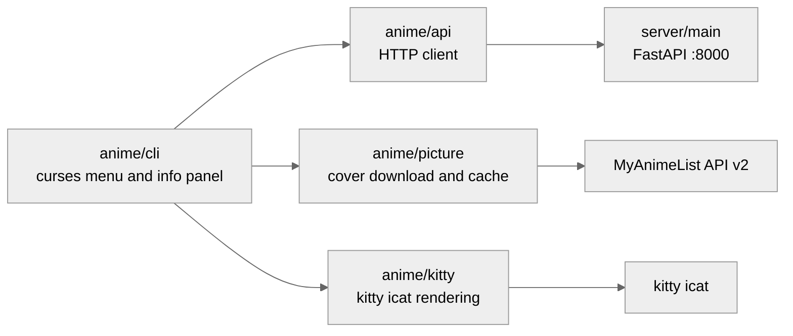

## Internal Architecture — Metadata

Internal layers and integrations of the Metadata area.

---

```mermaid
%%{init: {'theme': 'neutral'} }%%
flowchart LR
  CLI["anime/cli\ncurses menu and info panel"] --> API["anime/api\nHTTP client"]
  CLI --> Picture["anime/picture\ncover download and cache"]
  CLI --> Kitty["anime/kitty\nkitty icat rendering"]
  API --> Server["server/main\nFastAPI :8000"]
  Picture --> MAL["MyAnimeList API v2"]
  Kitty --> Icat["kitty icat"]
```

---

_Created at: 
