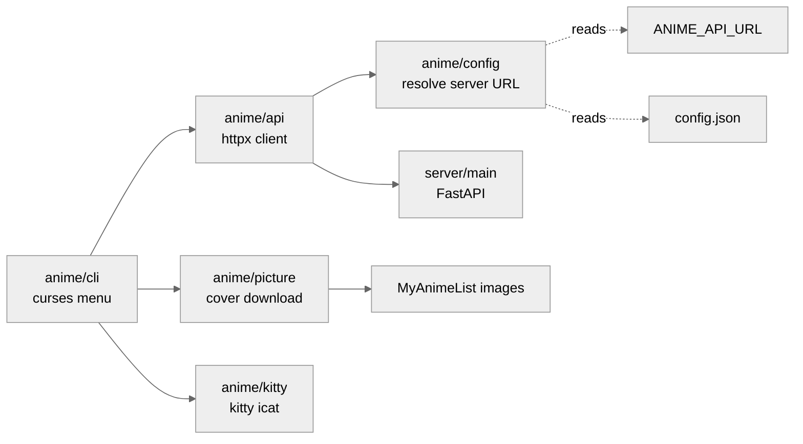

## Internal Architecture - Metadata

Internal layers and integrations of the Metadata area.

---

```mermaid
%%{init: {'theme': 'neutral'} }%%
flowchart LR
  CLI["anime/cli\ncurses menu"] --> API["anime/api\nhttpx client"]
  CLI --> PIC["anime/picture\ncover download"]
  CLI --> KIT["anime/kitty\nkitty icat"]
  API --> CFG["anime/config\nresolve server URL"]
  CFG -.->|reads| ENV["ANIME_API_URL"]
  CFG -.->|reads| CJ["config.json"]
  API --> SRV["server/main\nFastAPI"]
  PIC --> MALIMG["MyAnimeList images"]
```

---

_Created at: 2026-11-13 11:20_
