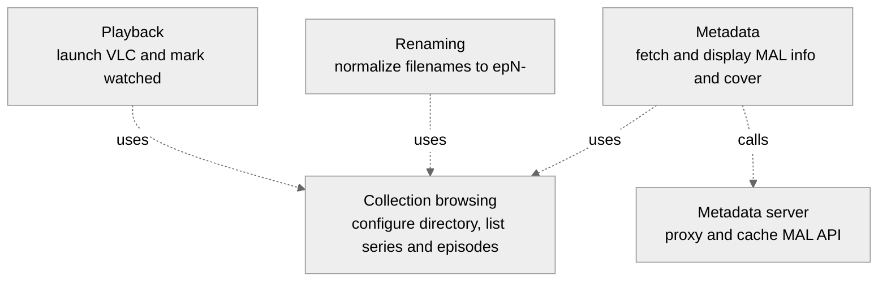

## Internal Architecture

Organization into modules and layers of the source code.

---

```mermaid
%%{init: {'theme': 'neutral'} }%%
flowchart TB
  Collection["Collection browsing\nconfigure directory, list series and episodes"]
  Playback["Playback\nlaunch VLC and mark watched"]
  Renaming["Renaming\nnormalize filenames to epN-"]
  Metadata["Metadata\nfetch and display MAL info and cover"]
  Server["Metadata server\nproxy and cache MAL API"]
  Playback -.->|uses| Collection
  Renaming -.->|uses| Collection
  Metadata -.->|uses| Collection
  Metadata -.->|calls| Server
```

---

_Created at: 
