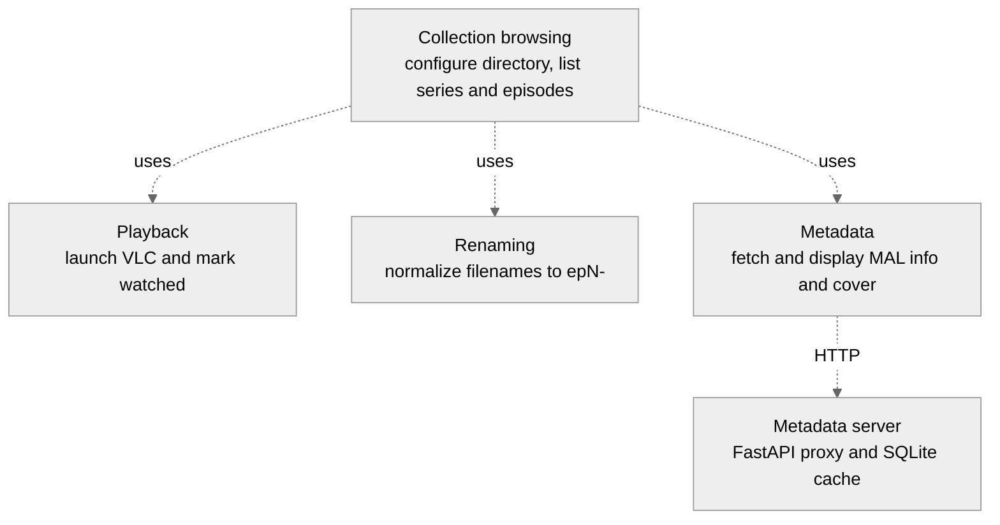

## Internal Architecture

Organization of the source code into modules and layers.

---

```mermaid
%%{init: {'theme': 'neutral'} }%%
flowchart TB
  Collection["Collection browsing\nconfigure directory, list series and episodes"]
  Playback["Playback\nlaunch VLC and mark watched"]
  Renaming["Renaming\nnormalize filenames to epN-"]
  Metadata["Metadata\nfetch and display MAL info and cover"]
  Server["Metadata server\nFastAPI proxy and SQLite cache"]
  Collection -.->|uses| Playback
  Collection -.->|uses| Renaming
  Collection -.->|uses| Metadata
  Metadata -.->|HTTP| Server
```

---

_Created at: 2026-11-13 11:20_
