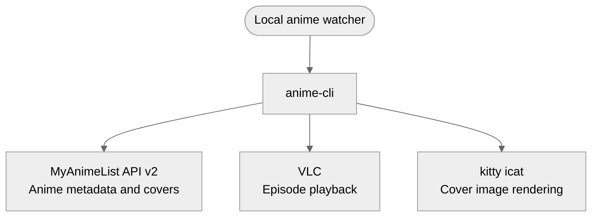

## Context

External view: actors, integrations and dependencies.

---

```mermaid
%%{init: {'theme': 'neutral'} }%%
flowchart TD
  U([Local anime watcher]) --> S[anime-cli]
  S --> MAL["MyAnimeList API v2\nAnime metadata and covers"]
  S --> VLC["VLC\nEpisode playback"]
  S --> K["kitty icat\nCover image rendering"]
```

---

_Created at: 2026-11-13 11:20_
