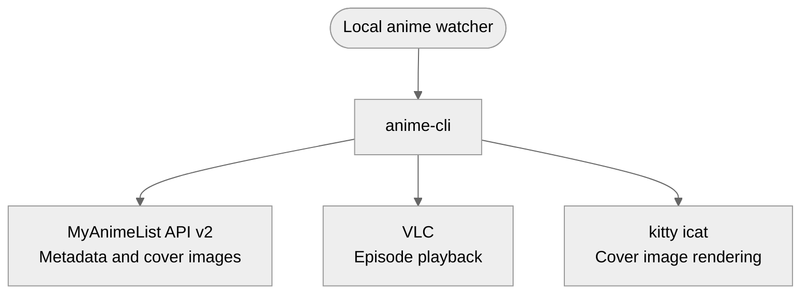

## Context

External view: actors, integrations and dependencies.

---

```mermaid
%%{init: {'theme': 'neutral'} }%%
flowchart TD
  A([Local anime watcher]) --> S[anime-cli]
  S --> E1["MyAnimeList API v2\nMetadata and cover images"]
  S --> E2["VLC\nEpisode playback"]
  S --> E3["kitty icat\nCover image rendering"]
```

---

_Created at: 
