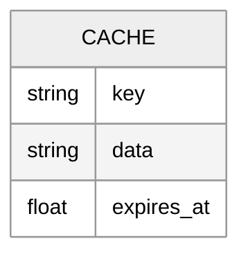

## Data Model

Entities, key fields and relations.

---

```mermaid
%%{init: {'theme': 'neutral'} }%%
erDiagram
  CACHE {
    string key
    string data
    float expires_at
  }
```

---

_Created at: 
