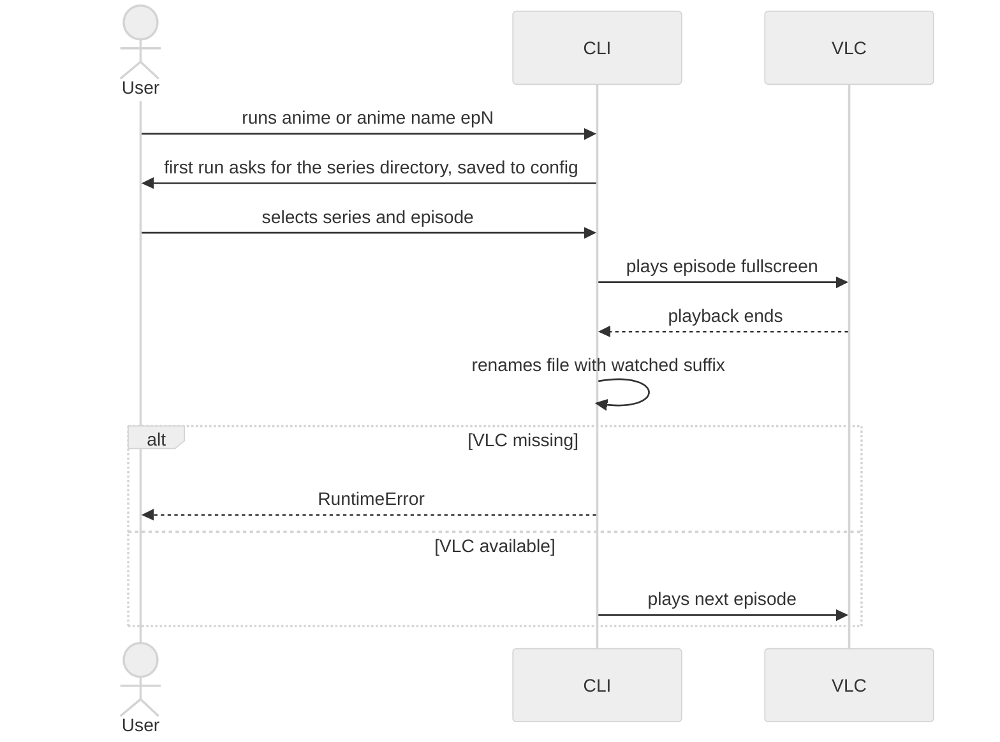
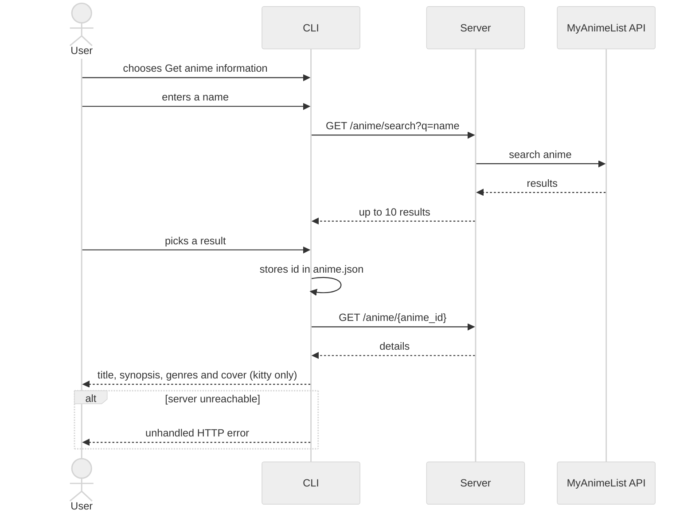

## User Flows

Sequence of interactions for the main application flows.

---

### Watch a series

```mermaid
%%{init: {'theme': 'neutral'} }%%
sequenceDiagram
  actor U as User
  participant C as CLI
  participant V as VLC
  U->>C: runs anime or anime name epN
  C->>U: first run asks for the series directory, saved to config
  U->>C: selects series and episode
  C->>V: plays episode fullscreen
  V-->>C: playback ends
  C->>C: renames file with watched suffix
  alt VLC missing
    C-->>U: RuntimeError
  else VLC available
    C->>V: plays next episode
  end
```

### Attach MyAnimeList info

```mermaid
%%{init: {'theme': 'neutral'} }%%
sequenceDiagram
  actor U as User
  participant C as CLI
  participant S as Server
  participant M as MyAnimeList API
  U->>C: chooses Get anime information
  U->>C: enters a name
  C->>S: GET /anime/search?q=name
  S->>M: search anime
  M-->>S: results
  S-->>C: up to 10 results
  U->>C: picks a result
  C->>C: stores id in anime.json
  C->>S: GET /anime/{anime_id}
  S-->>C: details
  C-->>U: title, synopsis, genres and cover (kitty only)
  alt server unreachable
    C-->>U: unhandled HTTP error
  end
```

---

_Created at: 
