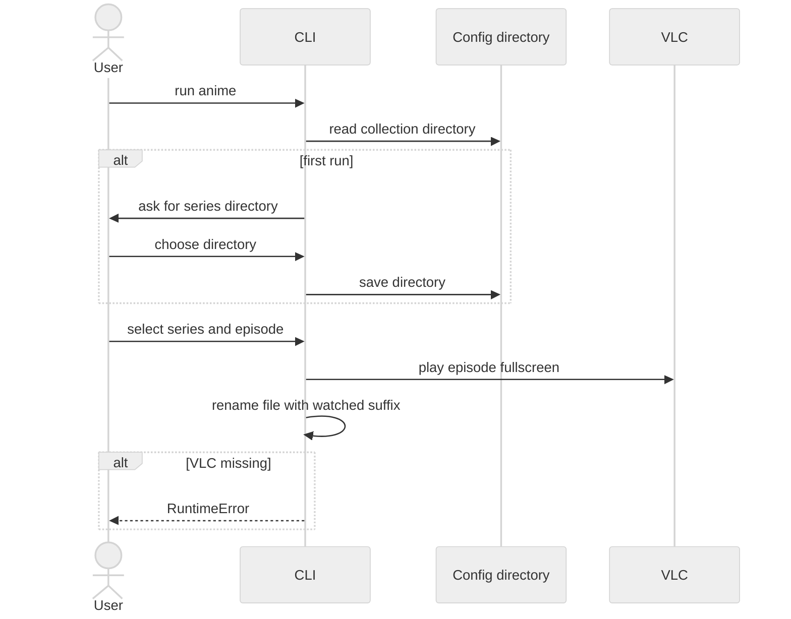
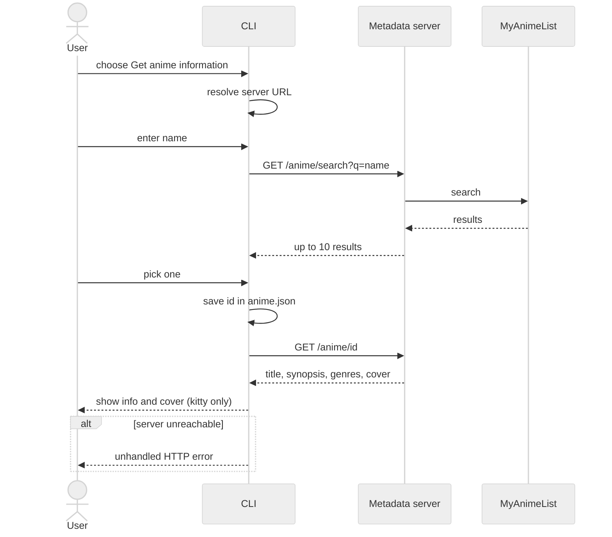

## User Flows

Interaction sequences for the main application flows.

---

### Watch a series

```mermaid
%%{init: {'theme': 'neutral'} }%%
sequenceDiagram
  actor U as User
  participant C as CLI
  participant D as Config directory
  participant V as VLC
  U->>C: run anime
  C->>D: read collection directory
  alt first run
    C->>U: ask for series directory
    U->>C: choose directory
    C->>D: save directory
  end
  U->>C: select series and episode
  C->>V: play episode fullscreen
  C->>C: rename file with watched suffix
  alt VLC missing
    C-->>U: RuntimeError
  end
```

### Attach MyAnimeList info

```mermaid
%%{init: {'theme': 'neutral'} }%%
sequenceDiagram
  actor U as User
  participant C as CLI
  participant S as Metadata server
  participant M as MyAnimeList
  U->>C: choose Get anime information
  C->>C: resolve server URL
  U->>C: enter name
  C->>S: GET /anime/search?q=name
  S->>M: search
  M-->>S: results
  S-->>C: up to 10 results
  U->>C: pick one
  C->>C: save id in anime.json
  C->>S: GET /anime/id
  S-->>C: title, synopsis, genres, cover
  C-->>U: show info and cover (kitty only)
  alt server unreachable
    C-->>U: unhandled HTTP error
  end
```

---

_Created at: 2026-11-13 11:20_
